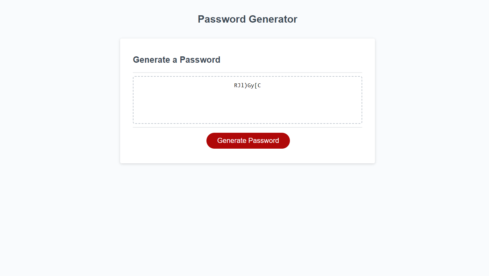
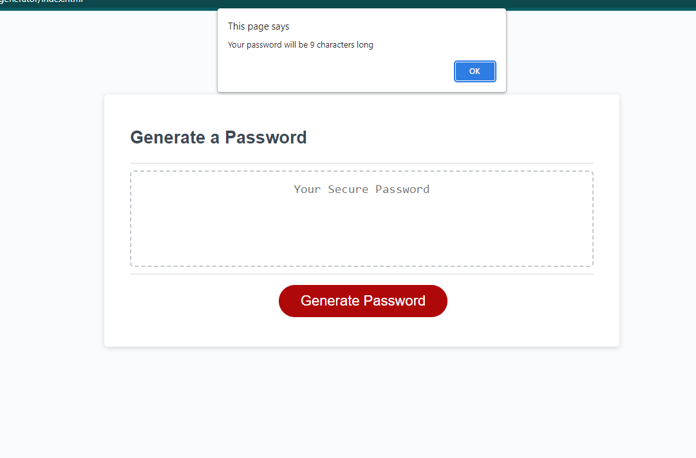
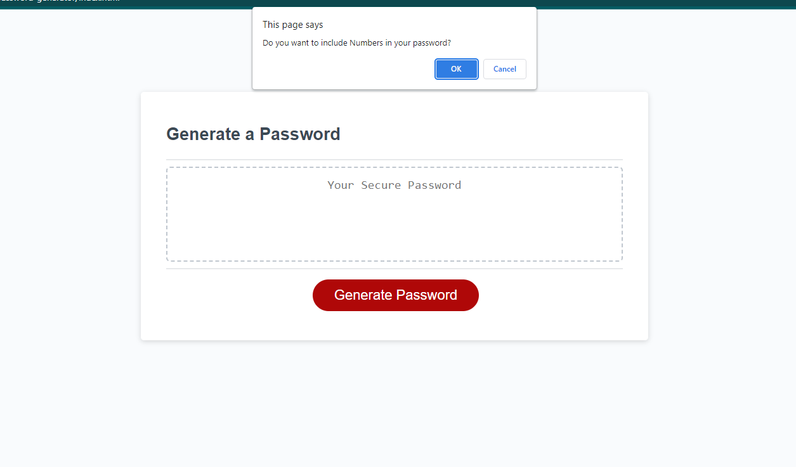
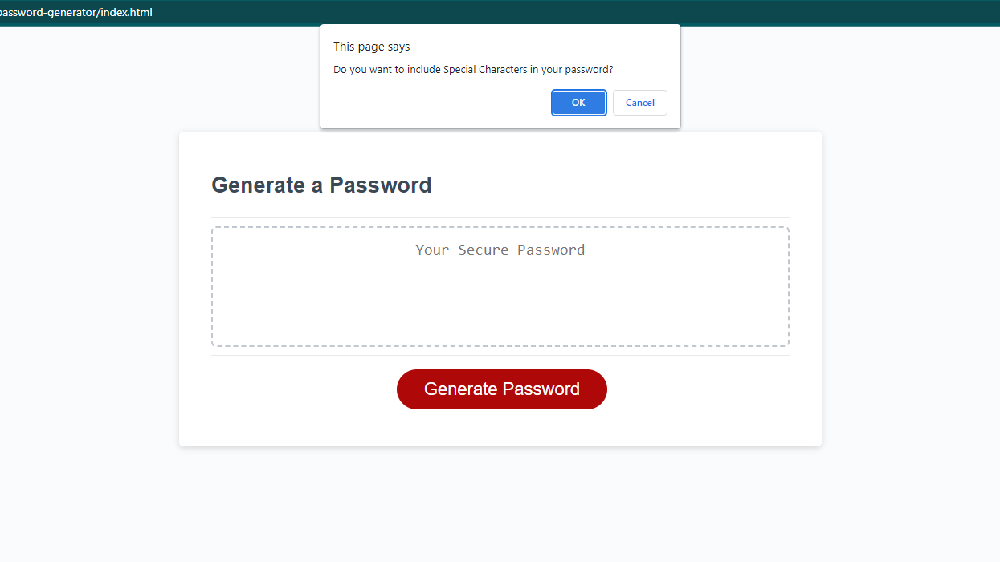
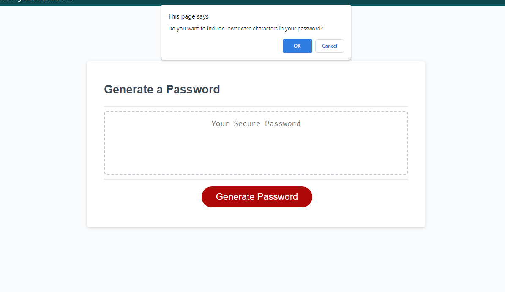
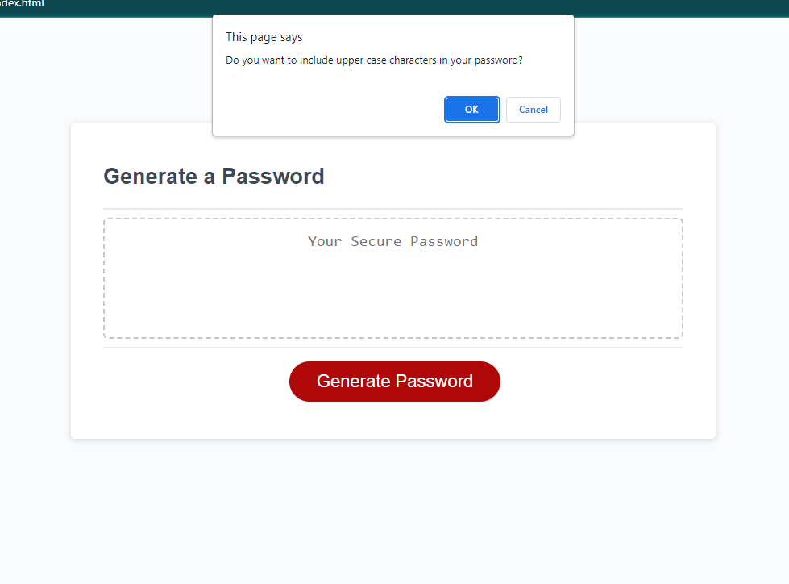
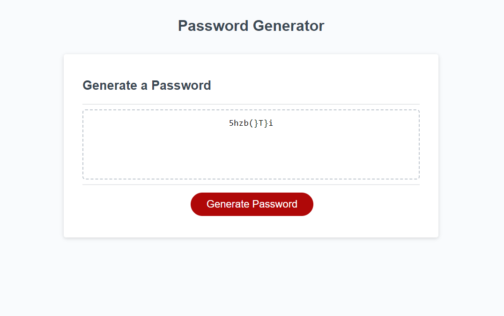

# Random Password Generator - Week - 3 - Challenge

## Description

This is a small functioning random password generator. The project itself is useful for everyone, because today almost everyone is carrying confidential financial information stored in their phone/laptops, but specially organizations that are managing confidential information and are required to have secure passwords for their ids. For me, the main purpose of this project was to work on my newfound JavaScript skills. In the very end, I collaborated with Mansi from AskBCSlearning assistant on slack to make the writePassword function work.

## Table of Contents

If your README is long, add a table of contents to make it easy for users to find what they need.

- [Installation](#installation)

- [Usage](#usage)

- [Credits](#credits)

- [License](#license)

- [Tests](#tests)

## Installation

The URL will mostly work in all the browsers. Preferred Browser is Google Chrome and the extension Chrome DevTools Extension to view the source code. GitHub is the cloud service for projects/repositories. You can simply visit the URL to view the repository in your browser: [Github Repo](https://github.com/hafsah1976/random-password-generator)

## Usage

This website can be used generate unique passwords. User would have to answer a series of prompts in order to get a unique password that would appear in the text area in the webpage. Below is a screenshot of the webpage showing a generated password:

## Credits

AskBCS learning assistance

[Password Special Characters](https://owasp.org/www-community/password-special-characters)

[Random Password Generator using JavaScript - Dev Community](https://dev.to/code_mystery/random-password-generator-using-javascript-6a)

[How to Generate a Random Password using JavaScript?](https://dev.to/code_mystery/random-password-generator-using-javascript-6a)

[Tutorials Tonight](https://www.tutorialstonight.com/free-online-html-editor?file=password-generator-in-javascript)

[Array Methods](https://developer.mozilla.org/en-US/docs/Web/JavaScript/Reference/Global_Objects/Array/isArray)

## License

Permission is hereby granted, free of charge, to any person obtaining a copy of this software and associated documentation files (the “Software”), to deal in the Software without restriction, including without limitation the rights to use, copy, modify, merge, publish, distribute, sublicense, and/or sell copies of the Software, and to permit persons to whom the Software is furnished to do so, subject to the following conditions:

The above copyright notice and this permission notice shall be included in all copies or substantial portions of the Software.

THE SOFTWARE IS PROVIDED “AS IS”, WITHOUT WARRANTY OF ANY KIND, EXPRESS OR IMPLIED, INCLUDING BUT NOT LIMITED TO THE WARRANTIES OF MERCHANTABILITY, FITNESS FOR A PARTICULAR PURPOSE AND NONINFRINGEMENT. IN NO EVENT SHALL THE AUTHORS OR COPYRIGHT HOLDERS BE LIABLE FOR ANY CLAIM, DAMAGES OR OTHER LIABILITY, WHETHER IN AN ACTION OF CONTRACT, TORT OR OTHERWISE, ARISING FROM, OUT OF OR IN CONNECTION WITH THE SOFTWARE OR THE USE OR OTHER DEALINGS IN THE SOFTWARE.

## Tests

### Testing 0 Value

Result as Expected:-

### Testing the web app with password length of 9:

Result as Expected:-

### Testing the criteria prompts and what the output includes after choosing to include all the criteria

- Confirming Numbers in my expected password

- Confirming Special Characters in my expected password

- Confirming Lower case characters in my expected password

- Confirming Upper Case letters in my expected password

- Expected Result:

